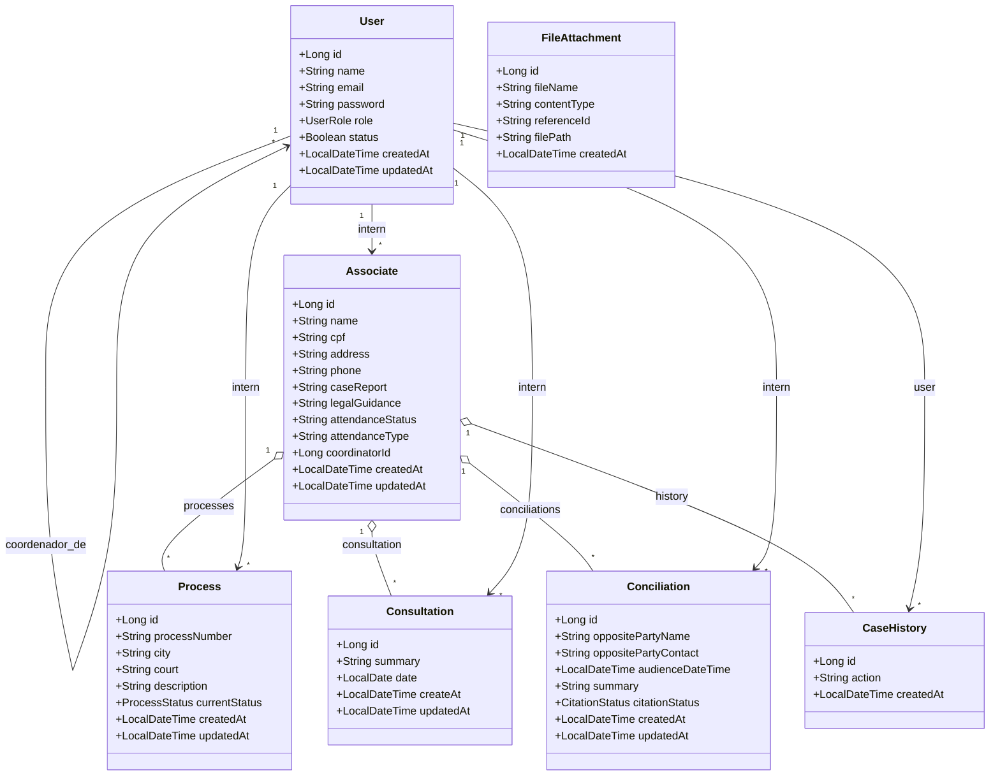

# ⚖️ Sistema Habitat
API REST para gestão e acompanhamento de processos jurídicos comunitários.

### 📋 Descrição
Backend do sistema de gestão que funciona como uma ponte digital entre a comunidade e a justiça. 

### 🚀 Tecnologias
* **Java 17+** - Linguagem base do ecossistema
* **Spring Boot 3.x** - Framework progressivo para o desenvolvimento da API
* **Spring Data JPA / Hibernate** - ORM para persistência e mapeamento de dados
* **PostgreSQL** - Banco de dados relacional para produção e persistência
* **Spring Security & JWT** - Autenticação, controle de sessões e proteção de rotas
* **Docker & Docker Compose** - Containerização do banco de dados e ambiente
* **Maven** - Gerenciador de dependências e automação de build

## 📦 Funcionalidades Implementadas

### 🔐 Autenticação & Controle de Acesso
* ✅ Login seguro com emissão de Token JWT
* ✅ Criptografia de senhas e validação de credenciais
* ✅ Proteção de rotas baseada em cargos de usuário (`UserRole`)

### 📂 Pasta Digital do Morador (Associados)
* ✅ Cadastro unificado com dados pessoais, CPF (único), telefone e endereço
* ✅ Registro centralizado do relatório do caso (`caseReport`) e orientações jurídicas (`legalGuidance`)
* ✅ Controle de status de atendimento (`triagem`, `documentacao`, `processo`, `finalizado`)

### 📊 Mural de Cards Inteligentes & Atendimentos
* ✅ Gestão de Processos Judiciais vinculados aos associados com número único, comarca e vara
* ✅ Agendamento e histórico de Conciliações com dados da parte contrária e status de citação
* ✅ Diário do Processo (Consultas) com resumos em formato TEXT e controle de datas
* ✅ Histórico de Ações (`CaseHistory`) automático gravando trilha de auditoria dos usuários

## 🛠️ Instalação & Configuração

### Pré-requisitos
* Java 17 ou superior instalado
* Docker e Docker Compose instalados

```bash
# 1. Clonar o repositório
git clone [https://github.com/seu-usuario/habitat-backend.git](https://github.com/seu-usuario/habitat-backend.git)

# 2. Entrar na pasta raiz do projeto
cd habitat-backend

# 3. Iniciar o container do banco de dados
docker-compose up -d

```

## 🎯 Executar o Projeto

### 🐧 Linux / macOS

```bash
cd app
./mvnw spring-boot:run

```

### 🪟 Windows

```cmd
cd app
mvnw.cmd spring-boot:run

```

O servidor backend estará rodando localmente em: `http://localhost:8080`

### 🧪 Testes

```bash
# Executar a suíte completa de testes unitários e de integração
./mvnw test

```

### 📁 Estrutura do Projeto

```text
habitat-backend/
├── docker-compose.yml              # Configuração do banco de dados PostgreSQL
├── .gitignore                      # Arquivos ignorados pelo Git
└── app/
    ├── pom.xml                     # Dependências Maven do projeto
    ├── Dockerfile                  # Build da imagem Docker do backend
    └── src/
        ├── main/
        │   └── java/org/example/
        │       ├── config/         # Segurança, Filtro JWT e Inicialização de dados
        │       ├── controllers/    # Endpoints REST expostos pela API
        │       ├── dtos/           # Objetos de transferência de dados (Request/Response)
        │       ├── enums/          # Enumeradores (UserRole, ProcessStatus, CitationStatus)
        │       ├── exceptions/     # Manipulador global de erros e exceções customizadas
        │       ├── mapper/         # Interfaces MapStruct de conversão DTO <-> Model
        │       ├── models/         # Entidades de mapeamento objeto-relacional (JPA)
        │       ├── repositories/   # Camada de persistência (Spring Data JPA Repositories)
        │       ├── services/       # Implementação das regras de negócio e lógica do sistema
        │       ├── tasks/          # Rotinas agendadas (ex: lembretes automáticos)
        │       └── Main.java       # Classe principal de inicialização do Spring Boot
        └── test/                   # Testes unitários e mocks da aplicação

```

## 📊 Diagrama de Classes



## 🔐 Endpoints Principais da API

### 🔑 Autenticação

* `POST /auth/login` - Autentica usuários e retorna o token JWT
* `POST /auth/register` - Registro inicial de novos integrantes

### 👥 Usuários e Estagiários

* `GET /users` - Lista todos os colaboradores ativos
* `GET /users/{id}` - Retorna detalhes de um usuário específico
* `PATCH /users/{id}` - Atualização cadastral e controle de status

### 📂 Fichas de Associados

* `POST /associates` - Cria um novo perfil digital de morador
* `GET /associates` - Listagem completa dos casos em triagem/atendimento
* `GET /associates/{id}` - Visualização detalhada do prontuário do morador

### 💼 Processos e Fluxos Judiciais

* `POST /processes` - Vincula um novo processo/card a um associado
* `PATCH /processes/{id}` - Altera a fase do processo (mudança visual de cores no mural)
* `POST /consultations` - Adiciona uma atualização no diário de atendimentos
* `POST /conciliations` - Registra uma nova audiência ou tentativa de acordo

### 🎨 Recursos Técnicos

* **CORS Habilitado** - Configurado globalmente para conexões cross-origin estáveis com o frontend.
* **Mecanismo** `@PrePersist` e `@PreUpdate` - Automatiza o preenchimento de trilhas de auditoria cronológica (`createdAt`, `updatedAt`).
* **Tratamento Global de Erros** - Interceptador global que formata respostas HTTP limpas e sem exposição de stacktrace interno para o cliente.

## 👨‍💻 Autores
- Diego Luiz
- Emmanuel Guerra
- Ingrid Souza
- José Miguel
- Kauã Oliveira
- Luan Richard
- Mariana Mendes
- Pedro Priori
- Renato Nascimento
- Rhodrigo Rodrigues


